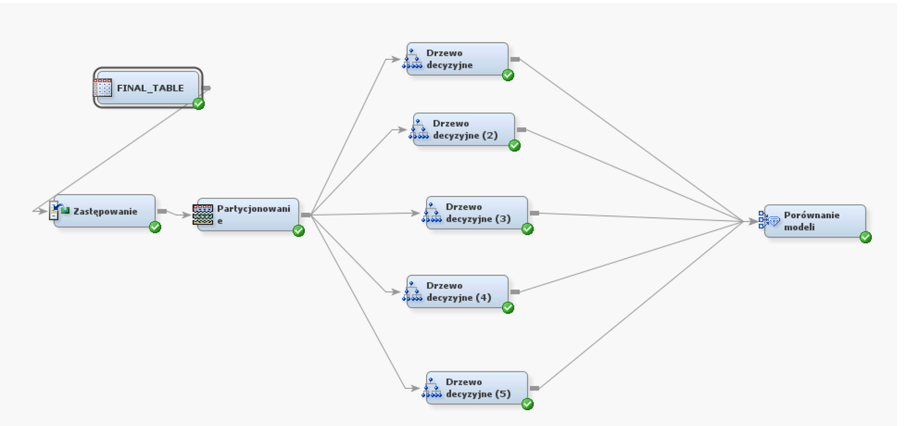
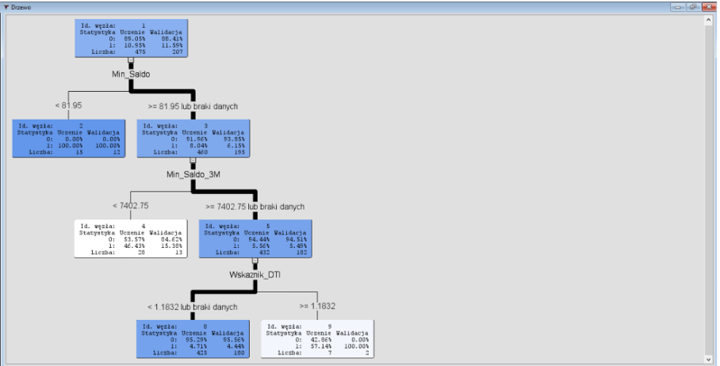

# Modelowanie ryzyka kredytowego w banku

**Technologie:** SAS Base, SAS SQL, SAS Enterprise Miner

## Cel projektu
Celem projektu jest klasyfikacja ryzyka kredytowego klientów banku. Model przewiduje zmienną `Default`, gdzie:
* [cite_start]`0` = Kredyt spłacony [cite: 5]
* [cite_start]`1` = Problemy ze spłatą (ryzyko niewypłacalności) [cite: 5]

## Organizacja Danych
Większość pracy w tym projekcie polegała na przygotowaniu danych (ETL). 
* Folder **`source_data/`** zawiera oryginalne, surowe tabele w natywnym formacie SAS (`.sas7bdat`). 
* Aby ułatwić przeglądanie wyników osobom nieposiadającym licencji SAS, gotowa tabela analityczna (połączenie wszystkich danych) została wyeksportowana i znajduje się w głównym folderze jako **`Final_Table.csv`**.

## ETL
[cite_start]Za pomocą **PROC SQL** w SAS Base połączono relacyjne tabele (demografia, historia transakcji, produkty)[cite: 434, 454, 481, 498]. [cite_start]Wygenerowano 30 zmiennych objaśniających, w tym kluczowe wskaźniki ryzyka [cite: 4-34]:
* **Wskaznik_DTI**: Rata kredytu podzielona przez miesięczny dochód[cite: 33].
* **Wskaznik_Oszczedzania**: Stosunek wydatków do wpływów na koncie[cite: 34].
* **Odchylenie_Salda**: Miara stabilności finansowej klienta (odchylenie standardowe salda)[cite: 25, 474].

Pełny skrypt łączący tabele i wyliczający zmienne znajduje się w pliku `przygotowanie_danych.sas`.

## Proces Modelowania
Analizę przeprowadzono w środowisku **SAS Enterprise Miner**. Zbudowano i przetestowano 5 wariantów drzew decyzyjnych w celu znalezienia optymalnej architektury.

## Wyniki i Wybór Modelu
Modele oceniono na zbiorze walidacyjnym, aby zminimalizować ryzyko przeuczenia.

* [cite_start]**Wybrany model:** Drzewo decyzyjne 2[cite: 368, 369].
* **Uzasadnienie:** Model osiągnął najniższy odsetek błędnych klasyfikacji na zbiorze walidacyjnym, wynoszący **ok. [cite_start]4,8% (0.0483)**[cite: 368, 369]. [cite_start]Zbyt rozbudowane modele (np. Drzewo 4 i 5) radziły sobie gorzej na nowych danych (błąd rzędu 6,2%), co świadczyło o ich przeuczeniu (overfittingu)[cite: 368].

